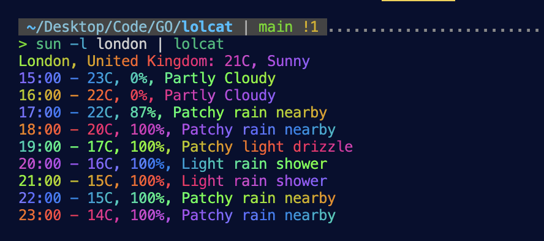

# Lolcat

Inapropriately named CLI rainbow pipe.

## Installation

To install run `go go get -u github.com/somtojf/lolcat`

## Usage

This tool is intended to be used as a pipe. It should be called alongside another CLI command which produces some output to the terminal.
To use this tool, run `<some command> | lolcat`
